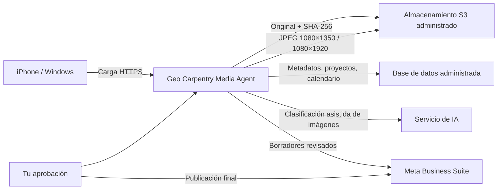

# Guía operativa y de alojamiento — Geo Carpentry Media Agent

## 1. Objetivo y finalidad

**Geo Carpentry Media Agent** es una biblioteca privada para transformar la colección desordenada de fotos y vídeos del iPhone en un archivo de negocio utilizable. Su finalidad es proteger los originales, separar contenido personal y de trabajo, encontrar problemas de calidad o duplicados, organizar cada obra y preparar únicamente los materiales que tú apruebes para Facebook e Instagram.

> **Principio de seguridad:** la aplicación respalda y verifica el original antes de proponer una clasificación, una exportación o una acción de limpieza. La aplicación **no borra nada del iPhone**, aun cuando apruebes un candidato. La aprobación solamente registra tu decisión para que la eliminación, si procede, se haga después desde el iPhone con la copia segura ya comprobada.

La aplicación no pretende sustituir Fotos de Apple ni publicar automáticamente en Meta. Es el **puente controlado** entre tu teléfono, el archivo de Geo Carpentry y el calendario de contenido.

| Problema actual | Lo que resuelve el agente | Resultado esperado |
|---|---|---|
| Miles de archivos mezclados en el iPhone | Respaldo y clasificación por tipo | Biblioteca ordenada y auditable |
| Fotos HEIC/MOV poco prácticas para redes | Exportaciones JPEG para Feed y Stories | Archivos listos para revisión en Meta |
| Material personal mezclado con obras | Categorías y revisión humana | Privacidad y contenido de negocio separados |
| Duplicados o fotos potencialmente borrosas | Propuestas de limpieza no destructivas | Menos ruido, sin riesgo de perder originales |
| Publicaciones improvisadas | Calendario visual con borradores | Publicación consistente, después de tu aprobación |

## 2. Qué se conecta con qué

La arquitectura actual usa servicios administrados de Manus. No depende de una carpeta local del servidor para los originales.

| Conexión | Para qué sirve | Estado actual | Qué debes hacer |
|---|---|---|---|
| **iPhone o Windows → aplicación** | Cargar lotes de HEIC, JPG, PNG, MOV y MP4 | Disponible | Iniciar sesión y cargar lotes moderados desde el navegador. |
| **Aplicación → S3** | Guardar el original y sus copias exportadas | Configurado en Manus | No configurar claves ni crear carpetas manualmente. |
| **Aplicación → base de datos** | Registrar archivo, checksum, categoría, proyecto, estado y calendario | Configurado en Manus | No se requiere acción manual. |
| **Aplicación → IA** | Clasificar fotos de forma asistida | Configurado en Manus | Revisar y corregir las categorías cuando sea necesario. |
| **Aplicación → Meta Business Suite** | Convertir borradores aprobados en publicaciones programadas | **Pendiente de conexión** | Dar acceso a la Página de Facebook y cuenta profesional de Instagram cuando lleguemos a esa fase. |

Meta Business Suite permite crear y programar publicaciones en Facebook e Instagram, por lo que es el destino correcto una vez que el material y el copy estén aprobados.[4]

## 3. Uso correcto, paso a paso

### Paso 1 — Conserva la primera copia del iPhone

Termina primero la importación desde el iPhone a `C:\GeoCarpentry_Media_Archive\01_INBOX_IPHONE`. Esa carpeta es la **fuente de recuperación local** y no debe organizarse ni depurarse todavía. Cuando la copia esté completa, revisaremos el conteo de archivos y espacio ocupado antes de iniciar carga a la aplicación.

### Paso 2 — Carga la biblioteca por lotes y conserva el comprobante

Abre la aplicación con tu cuenta de propietario y usa **“Cargar desde iPhone o computadora”**. La aplicación acepta exactamente **HEIC, JPG, PNG, MOV y MP4**. La carga muestra el nombre del archivo en curso, el porcentaje, los respaldados, duplicados y las incidencias; al terminar, el resultado queda guardado en **Historial de importaciones**.

Para una colección amplia, carga una carpeta mensual o un proyecto por vez. Los archivos de hasta **250 MB** pasan por el servidor para detectar duplicados antes de escribir una copia y calcular una señal de nitidez. Los archivos de más de 250 MB y hasta **1 GB** se cargan directamente al almacenamiento seguro y luego se verifican por tamaño y SHA-256. Cualquier archivo mayor de 1 GB se registra como incidencia para que puedas reducirlo o preparar una copia compatible sin perder el original local.

Cada archivo aceptado queda asociado a tu cuenta y recibe un checksum SHA-256. El original se copia al almacenamiento seguro y se vuelve a comprobar antes de marcarse como respaldado. Si intentas cargar el mismo archivo exacto, se registra como duplicado para revisión y no se crea una segunda ficha en la biblioteca.

> Si aparece **“Lote inicial recuperable”** en el resumen, usa **“Recuperar lote inicial”** una sola vez. Esta acción incorpora los originales verificados de la prueba anterior a tu cuenta de propietario y crea su comprobante en el historial.

### Paso 3 — Revisa la clasificación, no la aceptes a ciegas

En **Biblioteca**, cada archivo queda en una de estas categorías exactas:

| Categoría | Uso correcto |
|---|---|
| **Trabajos de Geo Carpentry** | Fotos de obras, materiales, herramientas, acabados, exteriores, interiores y procesos de construcción. |
| **Personal** | Fotos privadas que no deben entrar al flujo de contenido. |
| **Capturas de pantalla** | Capturas de teléfono, mensajes, inspiración, referencias o interfaces. |
| **Videos** | MOV y MP4; revisar manualmente cuál sirve para Reels o Stories. |
| **Pendiente de revisar** | Contenido sobre el que la aplicación no debe asumir una decisión. |

La clasificación de IA es una **sugerencia**. En Biblioteca puedes usar **“Clasificar 12”** para procesar hasta doce imágenes pendientes a la vez; los videos se identifican inicialmente por formato. Conserva la última palabra: corrige la categoría, asigna el proyecto de construcción y marca la etapa como **Antes**, **Durante** o **Después**. La clasificación por lote no sobrescribe una categoría que ya hayas decidido manualmente.

### Paso 4 — Revisa limpieza sin borrar

En **Limpieza** aparecerán dos tipos de propuestas: duplicados exactos y posibles fotos borrosas. Usa **Conservar** para descartar una propuesta o **Aprobar** para registrar que el archivo puede eliminarse en el futuro. Aprobar no borra nada, no mueve fotos y no afecta al iPhone.

Solo después de confirmar tres condiciones —respaldo verificado, revisión visual y aprobación expresa— se elimina el archivo desde Fotos en el iPhone. Conserva durante un periodo prudente la copia local y el original en S3 antes de hacer una limpieza definitiva.

### Paso 5 — Prepara piezas para redes

En cada foto de obra, genera una de estas copias:

| Destino | Archivo producido | Uso |
|---|---|---|
| **Feed** | JPEG **1080 × 1350** | Publicación vertical en Facebook e Instagram. |
| **Stories** | JPEG **1080 × 1920** | Story o base para Reel vertical. |

El original nunca se reemplaza; las exportaciones son derivados. Cuando el recorte automático no sea conveniente, conserva el original y prepara un recorte manual en la herramienta de edición que prefieras.

### Paso 6 — Planifica, revisa y publica solo con confirmación

En **Calendario**, selecciona la fecha, el archivo de obra, el formato y una nota de copy. Esto crea un **borrador** dentro del agente. Para Feed, usa una imagen; para Reel, usa un MP4 vertical. Presiona **Preparar** para validar que el medio está respaldado, que el formato coincide y que la pieza queda **Lista para publicar**.

La acción **“Publicar ahora”** abre una confirmación explícita antes de enviar contenido público a la Página. La aplicación no publica por fecha, no programa acciones automáticas y no publica contenido de prueba. Cada resultado conserva su estado y el identificador que devuelve Facebook. Las publicaciones de Página requieren permisos de publicación y una persona con la tarea `CREATE_CONTENT` en la Página.[5]

### Paso 7 — Instala el portal en tu teléfono

La app conserva la estructura práctica de las aplicaciones de `Geo Carpentry/budget`: es una **PWA** con manifiesto, icono, modo independiente y caché únicamente del armazón visual. Esto permite abrirla como aplicación desde el teléfono, pero **no guarda fotos, tokens, resultados de IA ni llamadas privadas de API en la caché**.

Después de publicar el proyecto en Manus, abre la URL en Safari para iPhone y elige **Compartir → Añadir a pantalla de inicio**, o en Chrome para Android elige **Instalar aplicación**. El acceso seguirá funcionando desde cualquier lugar con Internet; la biblioteca y las acciones privadas requieren conexión y tu sesión autenticada.

### Paso 8 — Conecta Facebook una sola vez

1. Publica la aplicación primero y, si usarás un dominio propio, termina de enlazar `media.geocarpentry.com`.
2. En Meta for Developers, abre la aplicación Business utilizada para esta integración y agrega esta URL válida de redirección: `https://TU-DOMINIO/api/facebook/callback`.
3. En el Calendario de Geo Media, pulsa **Conectar Facebook** e inicia sesión con la cuenta que administra la Página configurada.
4. Acepta únicamente los permisos solicitados para listar la Página y publicar contenido. El token de Página queda cifrado en la base de datos del servidor; nunca se envía al navegador.
5. Revisa el nombre de la Página mostrada en la aplicación. Si no es el correcto o no aparece, cancela y revisa que la cuenta tenga la tarea `CREATE_CONTENT` y acceso a esa Página.

Los Reels de Facebook se cargan y publican mediante una sesión de video de Meta. Meta recomienda MP4 vertical 9:16, 1080 × 1920, duración de 3–90 segundos y 24–60 fps; la API limita las publicaciones de Reels a 30 por Página en un periodo móvil de 24 horas.[6]

## 4. Cómo dejarla “viva”: recomendación de alojamiento

### Recomendación: publicar primero en Manus y usar un subdominio propio

Para esta versión, la forma más simple y menos riesgosa es mantener el agente en **alojamiento administrado de Manus** y asignarle un subdominio, por ejemplo `media.geocarpentry.com`. Hostinger puede seguir alojando `geocarpentry.com`, WordPress y el correo; desde el sitio principal solo se agrega un enlace privado como **“Portal de medios”**.

Esto evita migrar cuatro dependencias que hoy están preconfiguradas: autenticación, base de datos, almacenamiento S3 y clasificación por IA. También evita que tengas que administrar llaves privadas, copias de seguridad del servidor y despliegues de seguridad desde Hostinger.

| Componente | Dónde queda con la ruta recomendada | Quién lo administra |
|---|---|---|
| Aplicación web y API | Manus | Manus + Geo Carpentry |
| Dominio principal y WordPress | Hostinger | Geo Carpentry / proveedor web |
| Subdominio `media.geocarpentry.com` | DNS de Hostinger apuntando al dominio publicado en Manus | Geo Carpentry con la configuración guiada de dominio |
| Archivos, base de datos y clasificación | Servicios administrados de Manus | Manus |
| Publicación social | API de Facebook con autorización del propietario; Meta Business Suite como respaldo | Geo Carpentry |

Para activarla en Manus, abre el proyecto, crea o utiliza el último checkpoint y pulsa **Publish** en el panel de gestión. Después, en **Settings → Domains**, agrega el subdominio y copia en Hostinger el registro DNS que el panel indique. No es necesario mover el código a Hostinger para que tenga una URL de tu marca.

## 5. ¿Puede vivir en Hostinger? Sí, pero es una migración, no un simple botón

Hostinger admite aplicaciones Node.js en planes Business y Cloud, permite despliegue desde GitHub o un ZIP y soporta Express como backend; sus planes VPS dan más control del sistema y las dependencias.[1] [3] La aplicación actual usa React/Vite en el cliente y Express/Node.js en el servidor, así que **no debe subirse como una web estática**.

Para llevarla a Hostinger correctamente habría que hacer estas tareas antes de publicar:

| Dependencia actual de Manus | Qué habría que sustituir o configurar en Hostinger | Riesgo si se omite |
|---|---|---|
| Autenticación Manus OAuth | Proveedor de autenticación externo o sistema propio de usuarios | El inicio de sesión no funcionará. |
| Base de datos administrada | MySQL gestionado o base de datos externa, migraciones y copias de seguridad | Biblioteca y calendario no persistirán. |
| Almacenamiento S3 integrado | Bucket S3/R2/B2 y credenciales privadas de servidor | Los originales no podrán respaldarse de forma segura. |
| Servicio de IA integrado | API externa compatible y clave de servidor | La clasificación asistida dejará de funcionar. |
| Secretos administrados | Variables de entorno en hPanel | Riesgo de exponer claves o romper el despliegue. |
| Runtime de procesamiento de imágenes | Node 22+, `sharp`, límites de CPU/RAM y pruebas con HEIC | Fallos al exportar imágenes o al procesar lotes grandes. |

Hostinger permite agregar variables de entorno durante el despliegue y recomienda importarlas desde un `.env`, pero ese archivo **nunca debe entrar al repositorio GitHub**.[2] Tampoco deben copiarse a Hostinger las claves internas `BUILT_IN_*`, OAuth o S3 de Manus: no son credenciales portables.

Si insistes en Hostinger, la ruta adecuada es:

1. Crear un repositorio **privado** con el código.
2. Preparar una versión desacoplada de Manus: autenticación externa, base de datos propia, almacenamiento S3 externo y proveedor de IA.
3. Elegir **Node.js Web App** en un plan Business/Cloud para una primera versión de bajo volumen, o VPS si vas a procesar muchos vídeos/fotos grandes y necesitas control de recursos.[1] [3]
4. Configurar en hPanel el build y arranque (`pnpm build` y `pnpm start` o equivalentes tras la adaptación), más todas las variables de entorno.
5. Migrar la base de datos vacía, probar carga, checksum, exportaciones y calendario en un subdominio de prueba.
6. Solo después apuntar `media.geocarpentry.com` a Hostinger.

**Mi recomendación concreta:** no migres todavía. Publica en Manus, úsala con la primera importación del iPhone y valida que el flujo de clasificación y calendario te ahorra tiempo. Cuando sepas el volumen real de fotos, videos y usuarios, decidimos si la migración a Hostinger aporta alguna ventaja real.

## 6. Orden de ejecución recomendado para esta semana

1. Deja terminar la importación del iPhone a la carpeta local de Windows.
2. Publica el agente en Manus y conecta `media.geocarpentry.com` si deseas una URL propia.
3. Carga el primer lote de prueba y verifica que los originales queden respaldados.
4. Clasifica solo un proyecto completo para confirmar que las categorías y etapas reflejan tu forma de trabajar.
5. Genera tres piezas de prueba: un Feed, una Story y un vídeo corto revisado.
6. Revisa el calendario visual y aprueba el primer conjunto de borradores.
7. Configura la URL de redirección en Meta for Developers y conecta Facebook desde el Calendario.
8. Prepara un Feed o Reel real, revísalo y confirma manualmente la primera publicación.

## Referencias

[1] [Hostinger — How to add a Node.js Web App in Hostinger](https://www.hostinger.com/support/how-to-deploy-a-nodejs-website-in-hostinger/)

[2] [Hostinger — How to add environment variables during Node.js application deployment](https://www.hostinger.com/support/how-to-add-environment-variables-during-node-js-application-deployment/)

[3] [Hostinger — Node.js hosting options at Hostinger](https://www.hostinger.com/support/node-js-hosting-options-at-hostinger/)

[5] [Meta for Developers — Pages API: Posts](https://developers.facebook.com/documentation/pages-api/posts)

[6] [Meta for Developers — Reels Publishing API](https://developers.facebook.com/documentation/video-api/guides/reels-publishing)

[4] [Meta for Business — Create and Manage Posts in Meta Business Suite on Desktop](https://www.facebook.com/business/help/942827662903020)
